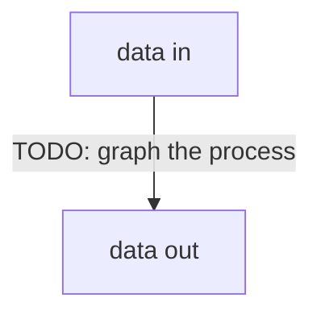

# Architecture

```mermaid
flowchart TD
    F["data in"]
    B["data out"]
    F --> |TODO: graph the process| B
```

TODO: https://matklad.github.io/2021/02/06/ARCHITECTURE.md.html

## Frameworks
`telebot` all the way, for absolutely all telegram interactions

## Other
HELP